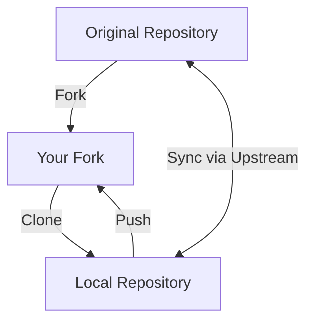
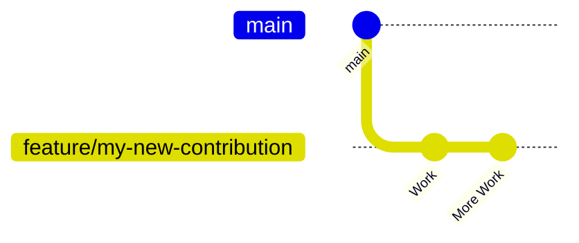
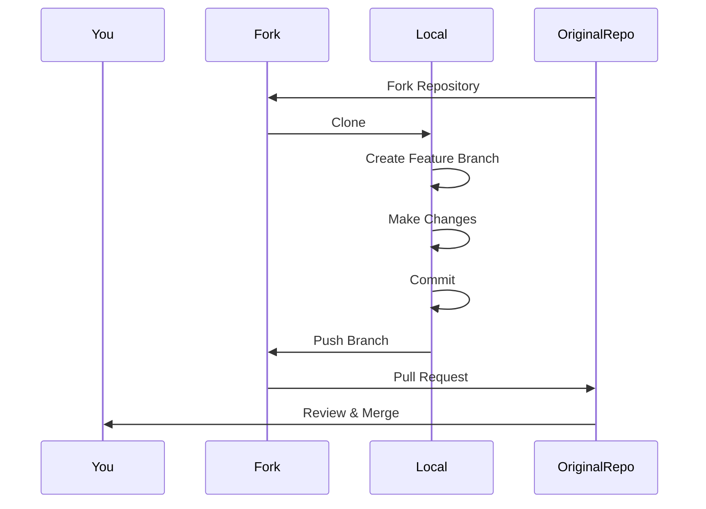

# Contribution

---

# 📌 Contribution Workflow

```mermaid
flowchart LR
    A[Fork Repository] --> B[Clone Your Fork]
    B --> C[Add Upstream Remote]
    C --> D[Create Feature Branch]
    D --> E[Setup Project]
    E --> F[Make Changes]
    F --> G[Commit Changes]
    G --> H[Push Branch]
    H --> I[Create Pull Request]
    I --> J[Code Review & Merge]
```



---

# Step 1 — Fork the Repository

Create your own copy of the repository on GitHub.

Visit:

> https://github.com/soorajsrj23/doby_website

Click the **Fork** button in the top-right corner.

Result:

```
Original Repository
        │
        ▼
Your GitHub Fork
```

---

# Step 2 — Clone Your Fork

Download your fork to your local machine.

Replace `YOUR_USERNAME` with your GitHub username.

```bash
git clone https://github.com/YOUR_USERNAME/doby_website.git
cd doby_website
```

Project structure now exists locally.

---

# Step 3 — Add the Upstream Remote

Your fork should stay synchronized with the original repository.

Add the original repository as **upstream**.

```bash
git remote add upstream https://github.com/soorajsrj23/doby_website.git
```

Verify remotes:

```bash
git remote -v
```

Expected output:

```
origin      https://github.com/YOUR_USERNAME/doby_website.git
upstream    https://github.com/soorajsrj23/doby_website.git
```

---

# Repository Relationship



---

# Step 4 — Create a Feature Branch

Never work directly on the `main` branch.

Create a new branch for every feature or bug fix.

```bash
git checkout -b feature/my-new-contribution
```

Examples:

```
feature/login-page

feature/dark-mode

feature/navbar-redesign

bugfix/footer-links

bugfix/mobile-navbar
```

---

# Git Branch Workflow



---

# Step 5 — Review the Project Setup

Understand how the project is built before making changes.

## If `package.json` exists

This is a JavaScript/Node.js project.

Install dependencies:

```bash
npm install
```

Run development server:

```bash
npm run dev
```

or

```bash
npm start
```

---

## If `requirements.txt` exists

Python project.

Create virtual environment:

```bash
python -m venv .venv
```

Activate:

### Windows

```bash
.venv\Scripts\activate
```

### macOS/Linux

```bash
source .venv/bin/activate
```

Install packages:

```bash
pip install -r requirements.txt
```

---

## Always Read

```
README.md
```

It usually contains:

- Installation instructions
- Project architecture
- Contribution rules
- Coding standards
- Environment variables

---

# Step 6 — Make Changes

Implement your:

- Feature
- Bug fix
- Documentation improvement
- UI enhancement
- Performance optimization

After verifying everything works correctly:

Stage all files:

```bash
git add .
```

Commit changes:

```bash
git commit -m "Fix: Description of the bug fixed or feature added"
```

Examples:

```bash
git commit -m "Fix: Navbar responsiveness"

git commit -m "Feature: Add FAQ section"

git commit -m "Docs: Update README"
```

---

# Step 7 — Push Your Branch

Upload your branch to your GitHub fork.

```bash
git push origin feature/my-new-contribution
```

Now your branch exists online.

---

# Step 8 — Create a Pull Request

Visit the original repository:

> https://github.com/soorajsrj23/doby_website

GitHub usually displays a yellow notification:

```
Compare & Pull Request
```

Click it.

Include:

- What changed
- Why it changed
- Screenshots (if UI changes)
- Related issue number (if applicable)

Submit the Pull Request for review.

---

# Complete Contribution Lifecycle



---

# Keeping Your Fork Updated

Before starting a new contribution:

Fetch latest changes:

```bash
git fetch upstream
```

Switch to main:

```bash
git checkout main
```

Merge upstream changes:

```bash
git merge upstream/main
```

Push updated main:

```bash
git push origin main
```

---

# Best Practices

## ✔ Check Existing Issues

Before starting work:

- Open the **Issues** tab.
- Ensure someone else is not already working on the same task.
- Read any discussion related to the issue.

---

## ✔ Keep Pull Requests Small

Good:

- One bug fix
- One feature
- One documentation update

Avoid combining unrelated changes into a single PR.

---

## ✔ Use Meaningful Commit Messages

Examples:

```text
Fix: Mobile navigation overlap

Feature: Add testimonials section

Refactor: Simplify authentication logic

Docs: Improve installation instructions

Style: Update button spacing
```

---

## ✔ Test Before Pushing

Always verify:

- Project builds successfully.
- No console errors.
- No failing tests.
- UI behaves correctly.

---

## ✔ Follow Project Style

Respect the project's:

- Folder structure
- Naming conventions
- Formatting rules
- Linting configuration

---

# Common Git Commands

| Purpose          | Command                        |
| ---------------- | ------------------------------ |
| Clone repository | `git clone URL`                |
| Check remotes    | `git remote -v`                |
| Create branch    | `git checkout -b feature/name` |
| View branches    | `git branch`                   |
| Stage changes    | `git add .`                    |
| Commit           | `git commit -m "message"`      |
| Push             | `git push origin branch-name`  |
| Fetch upstream   | `git fetch upstream`           |
| Merge upstream   | `git merge upstream/main`      |

---

# Quick Reference

```text
1. Fork Repository
        ↓
2. Clone Your Fork
        ↓
3. Add Upstream
        ↓
4. Create Feature Branch
        ↓
5. Install Dependencies
        ↓
6. Make Changes
        ↓
7. git add .
        ↓
8. git commit
        ↓
9. git push
        ↓
10. Create Pull Request
```

---

# Summary

Following this workflow ensures that:

- Your work remains isolated from the main branch.
- Your fork stays synchronized with the original repository.
- Contributions are easier to review.
- Pull requests remain clean and maintainable.
- Collaboration with project maintainers is smooth and efficient.

Happy Contributing! 🚀
